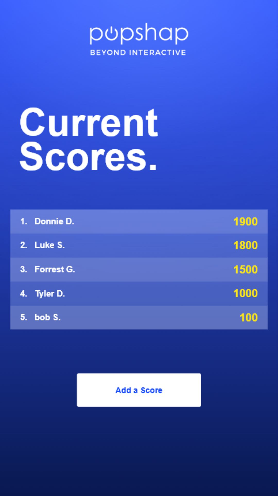
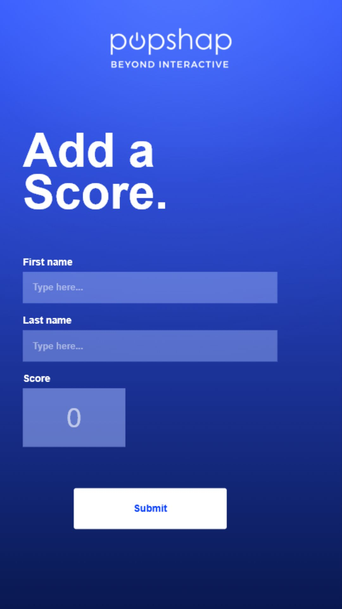

# Popshap Scores

React, TypeScript, SCSS, and Firebase Firestore implementation for the Popshap coding demo.

## Live Demo

https://popshap-score-app.vercel.app

## Screenshots

<p>
  
  
</p>

## Requirements Covered

- 1080px by 1920px kiosk-style React app
- Two pages: add a score and view current top scores
- Firebase Firestore persistence
- TypeScript and SCSS
- Basic validation, loading, success, error, and empty states
- Two Jest unit tests and one React Testing Library component test

## Setup

1. Install dependencies:

   ```bash
   npm install
   ```

2. Create `.env.local` from `.env.example` and add Firebase web app values:

   ```bash
   cp .env.example .env.local
   ```

3. In Firebase, create a Firestore database and use the included `firestore.rules` for assignment review access. This project includes a `.firebaserc` for the configured review project; replace the project ID if using a different Firebase project:

   ```bash
   npx firebase-tools@latest deploy --only firestore:rules --project popshap-score-app-jtset
   ```

4. Run locally:

   ```bash
   npm run dev
   ```

## Scripts

```bash
npm run dev
npm run build
npm test
```

## Firebase Files

- `firebase.json` points Firebase CLI at the local Firestore config.
- `firestore.rules` allows public reads and valid creates for the `submissions` collection only.
- `firestore.indexes.json` is included as an empty placeholder because this app does client-side top-five sorting after fetching submissions.

## Data Model

Firestore collection: `submissions`

```ts
{
  firstName: string
  lastName: string
  score: number
  createdAt: serverTimestamp()
}
```

The scores page fetches all submissions, sorts by score descending in a stable way, and displays the top five.

## Figma Note

The implementation was matched against the duplicated Figma draft, including the 1080px by 1920px canvas, centered Popshap logo, large white titles, translucent list/input rows, yellow score values, and white primary buttons.

## Submission Summary Draft

1. Time to complete: 1.5 hours
2. Easiest part: Building the small typed React structure and Firestore service layer was straightforward.
3. Most challenging part: Matching the kiosk-scale Figma layout cleanly in a responsive browser while keeping the implementation simple.
4. Tests included: Two Jest unit tests for validation and top-five stable sorting, plus one React Testing Library component test for the submit form success path.
